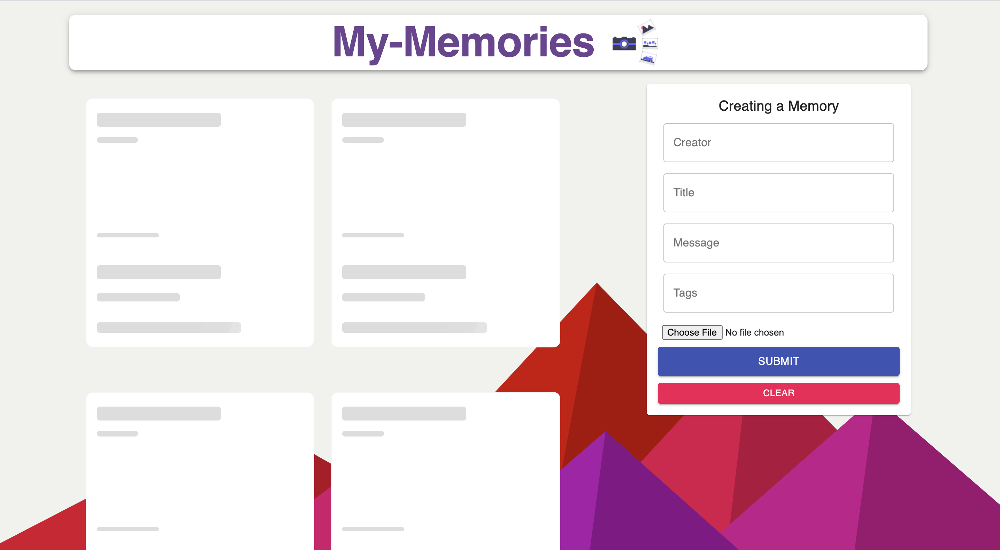
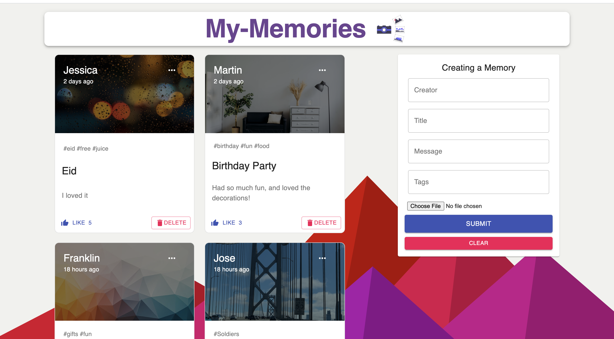

## SAVE YOUR MEMORIES

<a href="https://memories-react-node.netlify.app/" ><strong>LIVE DEMO</strong></a>

## App screenshots







## Tech Stack

React, CSS, Material UI, REST API, Node.js, Heroku, Netlify.

## App Details

Created a full-stack memories application to save your beautiful moments and customize them with the description.
User can create those memories, like them, edit them, and delete them.
Also implemented Skeleton loading for the posts.

## Run Instructions

Clone the repo
Needs database url and port number

```
cd client
npm i
npm start
```

```
cd server
npm i
npm start
```
